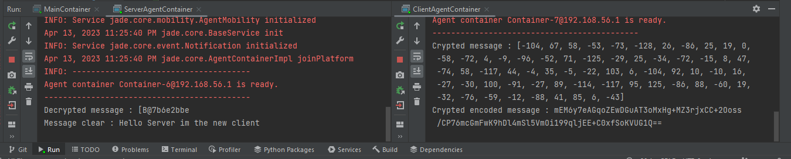
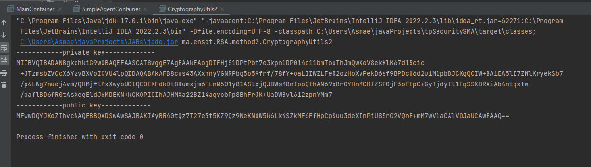
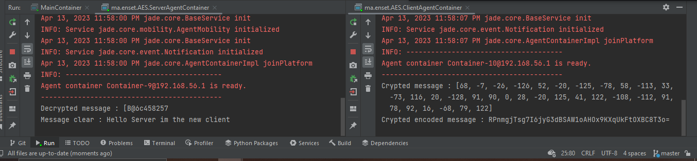

<h1>Distributed multi-agent system and AI </h1>

  Asmae EL HYANI  Distributed System & Artificial Intelligence Master’s  ENSET Mohammedia

   
<h2>Introduction</h2>

In today's world, the demand for secure communication has increased more than ever before. People need to communicate with each other for various reasons, such as business, education, healthcare, etc., while ensuring the confidentiality and integrity of their messages. To overcome the limitations of traditional communication methods and ensure secure communication, the use of multi-agent systems has become popular. Multi-agent systems consist of several autonomous agents that interact with each other to achieve a common goal.

The aim of this project is to implement a multi-agent system that enables secure message sharing between a clientAgent and a serverAgent. The clientAgent is responsible for sending messages to the serverAgent, and the serverAgent is responsible for receiving and processing the messages. To ensure the confidentiality and integrity of the messages, they will be encrypted using RSA and AES algorithms.

    
<ol type="I">
  <h2><li >Sending a message encrypted with RSA</li></h2>
<ul type="square">
<h2><li>First method</li> </h2>
</ul>

 <ol type="1">
<h3><li>ClientAgent</li></h3>

Create a client agent that sends an encrypted message to a server agent using RSA encryption and the public key we had gotten from arguments.We used also base64 for convert a byte message to string, then send the message to server.

<pre>
public class ClientAgent extends Agent {
    @Override
    protected void setup() {
        PublicKey publicKey=(PublicKey)getArguments()[0];
        String message="Hello Server";
        try {
            //Algorithm
            Cipher cipher=Cipher.getInstance("RSA");
            cipher.init(Cipher.ENCRYPT_MODE,publicKey);
            byte [] cryptedMsg= cipher.doFinal(message.getBytes());
            String cryptedEncodedMsg = Base64.getEncoder().encodeToString(cryptedMsg);
            ACLMessage aclMessage=new ACLMessage(ACLMessage.INFORM);
            aclMessage.addReceiver(new AID("server",AID.ISLOCALNAME));
            aclMessage.setContent(cryptedEncodedMsg);
            send(aclMessage);
            System.out.println("Crypted message : "+Arrays.toString(cryptedMsg));
            System.out.println("Crypted encoded message : "+cryptedEncodedMsg);
        } catch (Exception e) {
            throw new RuntimeException(e);
        }
    }
}
</pre>
    <h3><li>ServerAgent</li></h3>

The server receive the message from the client, the message is on format string, so we converted to byte using base64, then decrypted the message using the private key we had gotten from arguments and write it on the console 

<pre>
public class ServerAgent extends Agent {
    @Override
    protected void setup() {
        PrivateKey privateKey=(PrivateKey) getArguments()[0];
        addBehaviour(new CyclicBehaviour() {
            @Override
            public void action() {
                ACLMessage recieve = receive();
                if(recieve!=null){
                    String crypteEncodeddMsg=recieve.getContent();
                    byte[] cryptedMsg= Base64.getDecoder().decode(crypteEncodeddMsg);
                    try {
                        Cipher cipher= Cipher.getInstance("RSA");
                        cipher.init(Cipher.DECRYPT_MODE,privateKey);
                        byte[] decryptedMsg=cipher.doFinal(cryptedMsg);
                        System.out.println("Decrypted message : "+ decryptedMsg);
                        System.out.println("Message clear : "+new String(decryptedMsg));
                    } catch (Exception e) {
                        throw new RuntimeException(e);
                    }
                }
            }
        });
    }
}
</pre>
<h3><li>SimpleAgentContainer</li></h3>

The class is for creat two agents (client and server)

<pre>
public class SimpleAgentContainer {
    public static void main(String[] args) throws Exception{
        Runtime instance =Runtime.instance();
        ProfileImpl profile=new ProfileImpl();
        profile.setParameter(ProfileImpl.MAIN_HOST,"localhost");
        AgentContainer agentContainer= (AgentContainer) instance.createAgentContainer(profile);
        KeyPair keyPair = CryptographyUtils.generateRSAKeys();
        PrivateKey privateKey=keyPair.getPrivate();
        PublicKey publicKey=keyPair.getPublic();
        AgentController server=agentContainer.createNewAgent("server","ma.enset.RSA.method1.ServerAgent",new Object[]{privateKey});
        AgentController client=agentContainer.createNewAgent("client","ma.enset.RSA.method1.ClientAgent",new Object[]{publicKey});
        server.start();
        client.start();
    }
}
</pre>
<h3><li>Generate RSA keys</li></h3>

The methode is for generate the RSA keys

<pre>
public static KeyPair generateRSAKeys() throws  Exception{
        KeyPairGenerator keyPairGenerator=KeyPairGenerator.getInstance("RSA");
        keyPairGenerator.initialize(512);
        KeyPair keyPair=keyPairGenerator.generateKeyPair();
        return keyPair;
    }
</pre>
</ol>
<ul type="square">
<h2><li>Second method</li> </h2>

Same as the first method, the difference is that we separated the simpleAgentContainer to two classes one to create server agent (ServerAgentContainer) the other is to create client agent (ClientAgentContainer).

</ul>

Execution

 <ol type="1">
<h3><li>Generate RSA keys</li></h3>

The first thing is to generate the RSA keys, then take the keys and give it to the client agent and the server agent to encrypted and decrypted the message.

<pre>
public class CryptographyUtils2 {
    public static void main(String[] args) throws Exception{
        KeyPair keyPair=CryptographyUtils.generateRSAKeys();
        PrivateKey privateKey=keyPair.getPrivate();
        PublicKey publicKey=keyPair.getPublic();
        String encodedPK = Base64.getEncoder().encodeToString(privateKey.getEncoded());
        String encodedPpK = Base64.getEncoder().encodeToString(publicKey.getEncoded());
        System.out.println("------------private key-------------");
        System.out.println(encodedPK);
        System.out.println("------------public key-------------");
        System.out.println(encodedPpK);
    }
}
</pre>
<h3><li>ClientAgent</li></h3>

Create a client agent that sends an encrypted message to a server agent using the public key he had gotten from arguments.We used also base64 for convert a byte message to string, then send the message to server.

<pre>
public class ClientAgent extends Agent {
    @Override
    protected void setup() {
        String encodedPbk=(String) getArguments()[0];
        byte[] decodedPbk=Base64.getDecoder().decode(encodedPbk);
        String message="Hello Server";
        try {
            KeyFactory keyFactory=KeyFactory.getInstance("RSA");
            PublicKey publicKey=keyFactory.generatePublic(new X509EncodedKeySpec(decodedPbk));
            Cipher cipher=Cipher.getInstance("RSA");
            cipher.init(Cipher.ENCRYPT_MODE,publicKey);
            byte [] cryptedMsg= cipher.doFinal(message.getBytes());
            String cryptedEncodedMsg = Base64.getEncoder().encodeToString(cryptedMsg);
            ACLMessage aclMessage=new ACLMessage(ACLMessage.INFORM);
            aclMessage.addReceiver(new AID("server",AID.ISLOCALNAME));
            aclMessage.setContent(cryptedEncodedMsg);
            send(aclMessage);
            System.out.println("Crypted message : "+Arrays.toString(cryptedMsg));
            System.out.println("Crypted encoded message : "+cryptedEncodedMsg);
        } catch (Exception e) {
            throw new RuntimeException(e);
        }
    }
}
</pre>
    <h3><li>ServerAgent</li></h3>

The server receive the message from the client, the message is on format string, so we converted to byte using base64, then decrypted the message using the private key we had gotten from arguments and write it on the console 

<pre>
public class ServerAgent extends Agent {
    @Override
    protected void setup() {
        String encodedPk=(String) getArguments()[0];
        addBehaviour(new CyclicBehaviour() {
            @Override
            public void action() {
                ACLMessage recieve = receive();
                if(recieve!=null){
                    String crypteEncodeddMsg=recieve.getContent();
                    byte[] cryptedMsg= Base64.getDecoder().decode(crypteEncodeddMsg);
                    try {
                        byte[] decodedPk=Base64.getDecoder().decode(encodedPk);
                        KeyFactory keyFactory=KeyFactory.getInstance("RSA");
                        PrivateKey privateKey=keyFactory.generatePrivate(new PKCS8EncodedKeySpec(decodedPk));
                        Cipher cipher= Cipher.getInstance("RSA");
                        cipher.init(Cipher.DECRYPT_MODE,privateKey);
                        byte[] decryptedMsg=cipher.doFinal(cryptedMsg);
                        System.out.println("Decrypted message : "+ decryptedMsg);
                        System.out.println("Message clear : "+new String(decryptedMsg));
                    } catch (Exception e) {
                        throw new RuntimeException(e);
                    }
                }
            }
        });
    }
}
</pre>
<h3><li>ServerAgentContainer</li></h3>

The class is for creat server agent.

<pre>
public class ServerAgentContainer {
    public static void main(String[] args) throws Exception {
        Runtime instance =Runtime.instance();
        ProfileImpl profile=new ProfileImpl();
        profile.setParameter(ProfileImpl.MAIN_HOST,"localhost");
        AgentContainer agentContainer= (AgentContainer) instance.createAgentContainer(profile);
        String encodedPk="MIIBVQIBADANBgkqhkiG9w0BAQEFAASCAT8wggE7AgEAAkEAogDIFHjS1DPtPbt7e3kpn1DP014o11bmTouThJmQwXoV8ekKlK67d15cic+JTzmsbZVCcX6YzvBXVoICVU4lpQIDAQABAkAFB8cus43AXxhnyVGNRPbg5o59frf/78fY+oaLIIWZLFeR2ozHoXvPekD6sf9BPDcO6d2uiM1pbDJCKgQCIW+BAiEA5lI7ZMlKryekSb7/p4LWg7nuej4vm/QHMjflPxXwyoUCIQC0EKFdkDt8Rumxjm6FLnN501y81ASlxjQJBWsM8nIooQIhAN69oBr0YHnMCKIZSP0jF3oFEpC+GyTjdyIl1FqSSXBRAiAb4ntqxtw/aaflBD6fR0tAsXeqEldJ6MDEKN+kGKOPIQIhAJHMXa22BZ14aqvcbPp8BhFrJK+UaDWBvl612zpnYMm7";
        AgentController server=agentContainer.createNewAgent("server","ma.enset.RSA.method2.ServerAgent",new Object[]{encodedPk});
        server.start();
    }
}
</pre>
<h3><li>ClientAgentContainer</li></h3>

The class is for creat client Agent.

<pre>
public class ClientAgentContainer {
    public static void main(String[] args) throws Exception {
        Runtime instance =Runtime.instance();
        ProfileImpl profile=new ProfileImpl();
        profile.setParameter(ProfileImpl.MAIN_HOST,"localhost");
        AgentContainer agentContainer= (AgentContainer) instance.createAgentContainer(profile);
        String encodedPbk="MFwwDQYJKoZIhvcNAQEBBQADSwAwSAJBAKIAyBR40tQz7T27e3t5KZ9Qz9NeKNdW5k6Lk4SZkMF6FfHpCpSuu3deXInPiU85rG2VQnF+mM7wV1aCAlVOJaUCAwEAAQ==";
        AgentController client=agentContainer.createNewAgent("client","ma.enset.RSA.method2.ServerAgent",new Object[]{encodedPbk});
        client.start();
    }
}
</pre>

</ol>
  <h2><li >Sending a message encrypted with AES</li></h2>

<ol type="1">
<h3><li>ClientAgent</li></h3>

Create a client agent that sends an encrypted message to a server agent using AES secretkey he had gotten from arguments.We used also base64 for convert a byte message to string, then send the message to server.

<pre>
public class ClientAgent extends Agent {
    @Override
    protected void setup() {
        String secret=(String) getArguments()[0];
        String message="Hello Server im the new client";
        try {
            SecretKey secretKey=new SecretKeySpec(secret.getBytes(),"AES");
            Cipher cipher=Cipher.getInstance("AES");
            cipher.init(Cipher.ENCRYPT_MODE,secretKey);
            byte [] cryptedMsg= cipher.doFinal(message.getBytes());
            String cryptedEncodedMsg = Base64.getEncoder().encodeToString(cryptedMsg);
            ACLMessage aclMessage=new ACLMessage(ACLMessage.INFORM);
            aclMessage.addReceiver(new AID("server",AID.ISLOCALNAME));
            aclMessage.setContent(cryptedEncodedMsg);
            System.out.println("Crypted message : "+Arrays.toString(cryptedMsg));
            System.out.println("Crypted encoded message : "+cryptedEncodedMsg);
            send(aclMessage);
        } catch (Exception e) {
            throw new RuntimeException(e);
        }
    }
}
</pre>
    <h3><li>ServerAgent</li></h3>

The server receive the message from the client, the message is on format string, so we converted to byte using base64, then decrypted the message using secretkey we had gotten from arguments and write it on the console 

<pre>
public class ServerAgent extends Agent {
    @Override
    protected void setup() {
        String secret=(String) getArguments()[0];
        addBehaviour(new CyclicBehaviour() {
            @Override
            public void action() {
                ACLMessage recieve = receive();
                if(recieve!=null){
                    String crypteEncodeddMsg=recieve.getContent();
                    byte[] cryptedMsg= Base64.getDecoder().decode(crypteEncodeddMsg);
                    try {
                        SecretKey secretKey=new SecretKeySpec(secret.getBytes(),"AES");
                        Cipher cipher=Cipher.getInstance("AES");
                        cipher.init(Cipher.DECRYPT_MODE,secretKey);
                        byte[] decryptedMsg=cipher.doFinal(cryptedMsg);
                        System.out.println("Decrypted message : "+ decryptedMsg);
                        System.out.println("Message clear : "+new String(decryptedMsg));
                    } catch (Exception e) {
                        throw new RuntimeException(e);
                    }
                }
            }
        });
    }
}
</pre>
<h3><li>ServerAgentContainer</li></h3>

The class is for creat server agent.

<pre>
public class ServerAgentContainer {
 public class ServerAgentContainer {
    public static void main(String[] args) throws Exception {
        Runtime instance =Runtime.instance();
        ProfileImpl profile=new ProfileImpl();
        profile.setParameter(ProfileImpl.MAIN_HOST,"localhost");
        AgentContainer agentContainer= (AgentContainer) instance.createAgentContainer(profile);
        String secret="1234561234561234";//128 bits
        AgentController server=agentContainer.createNewAgent("server","ma.enset.AES.ServerAgent",new Object[]{secret});
        server.start();
    }
}
</pre>
<h3><li>ClientAgentContainer</li></h3>

The class is for creat client Agent.

<pre>
public class ClientAgentContainer {
    public class ClientAgentContainer {
    public static void main(String[] args) throws Exception {
        Runtime instance =Runtime.instance();
        ProfileImpl profile=new ProfileImpl();
        profile.setParameter(ProfileImpl.MAIN_HOST,"localhost");
        AgentContainer agentContainer= (AgentContainer) instance.createAgentContainer(profile);
        String secret="1234561234561234";//128 bits
        AgentController client=agentContainer.createNewAgent("client","ma.enset.AES.ClientAgent",new Object[]{secret});
        client.start();
    }
}
</pre>
</ol>
</ol>